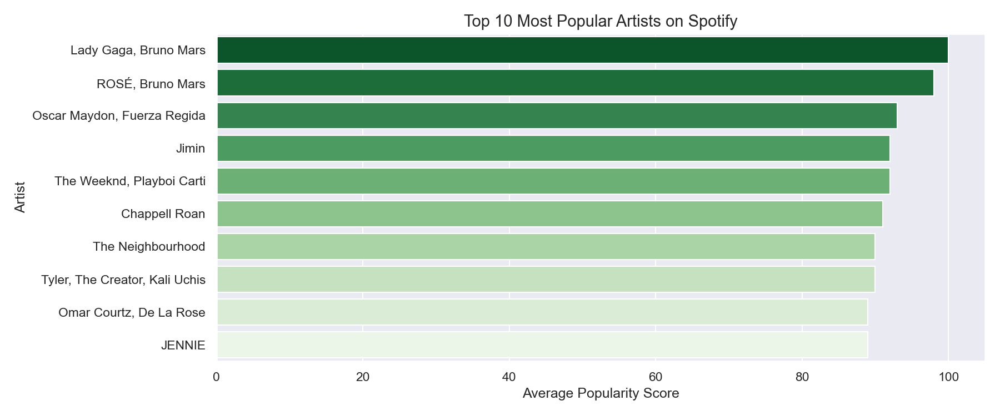
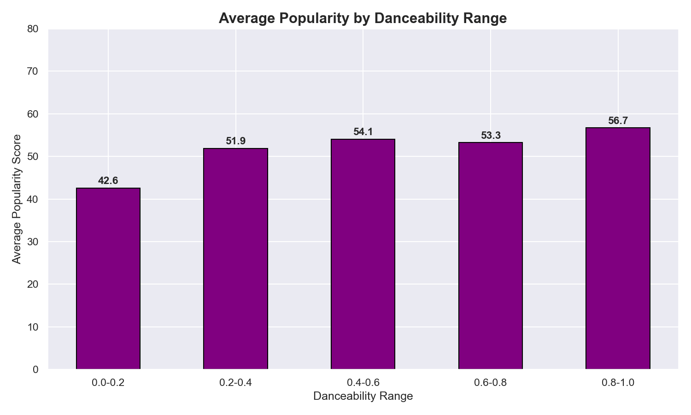
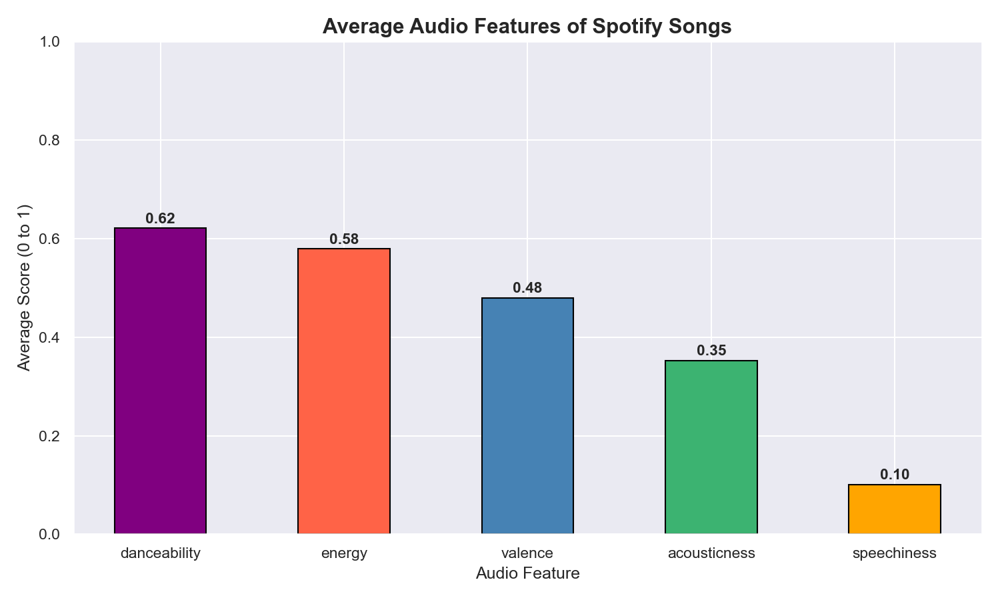
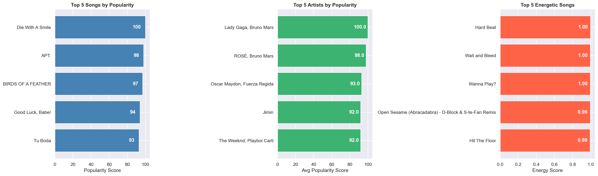

#  Spotify Music Analysis

A data analysis project on Spotify songs dataset using Python. The project explores audio features, artist popularity, danceability trends, and provides Top 5 recommendations across multiple categories.

---

##  Dataset

| File | Description |
|---|---|
| `high_popularity_spotify_data.csv` | Songs with high popularity scores |
| `low_popularity_spotify_data.csv` | Songs with low popularity scores |

- **Total Records:** ~4,800 songs (after merging both files)
- **Source:** [Kaggle - Spotify Tracks Dataset](https://www.kaggle.com/)
- **Features Used:** `track_name`, `track_artist`, `track_popularity`, `danceability`, `energy`, `valence`, `acousticness`, `speechiness`, `playlist_genre`, `track_album_release_date`

---

##  Tools & Libraries

- **Python 3.14**
- **Pandas** — data loading, cleaning, and analysis
- **Matplotlib** — chart plotting
- **Seaborn** — styled visualizations
- **Jupyter Notebook** — interactive development environment

---

##  Analysis Performed

### 1. Most Popular Artists
Bar chart showing the **Top 10 artists** ranked by their average popularity score across all songs.



---

### 2. Danceability vs Popularity
Bar chart comparing **average popularity score** across 5 danceability ranges (0.0–1.0), showing how danceability affects a song's popularity.



> **Observation:** Songs with medium to high danceability (0.4–1.0) tend to have higher popularity scores. Very low danceability songs (0.0–0.2) are consistently less popular.

---

### 3. Audio Feature Trends Over Time
Line chart tracking how **5 key audio features** (danceability, energy, valence, acousticness, speechiness) have changed year by year across Spotify songs.



> **Observation:** Energy and danceability have remained consistently high over the years, while acousticness shows a declining trend in modern music.

---

### 4. Top 5 Recommendations
Three side-by-side bar charts showing:
-  **Top 5 Songs** by popularity score
-  **Top 5 Artists** by average popularity
-  **Top 5 Energetic Songs** by energy score



---

##  Key Findings

- **Most Popular Song:** Die With A Smile — Lady Gaga & Bruno Mars (Score: 100)
- **Most Popular Artist:** Lady Gaga, Bruno Mars (Avg Score: 100)
- **Most Energetic Song:** Hard Beat (Energy: 1.00)
- Songs with **danceability between 0.4–0.8** dominate the popularity charts
- **Energy** is the most consistently high audio feature across all years

---

##  Project Structure

```
spotify-music-analysis/
│
├── Spotify Music Analysis.ipynb       # Main notebook with all analysis code
├── high_popularity_spotify_data.csv   # Dataset - high popularity songs
├── low_popularity_spotify_data.csv    # Dataset - low popularity songs
├── most_popular_artists.png           # Chart - Top 10 artists
├── danceability_vs_popularity.png     # Chart - Danceability vs Popularity
├── audio_features_trend.png           # Chart - Audio features over time
├── top5_summary.png                   # Chart - Top 5 recommendations
└── README.md                          # Project documentation
```

---

##  How to Run

1. Clone the repository:
```bash
git clone https://github.com/gurshandhiman21-cpu/spotify-music-analysis.git
```

2. Install dependencies:
```bash
pip install pandas matplotlib seaborn
```

3. Open the notebook:
```bash
jupyter notebook "Spotify Music Analysis.ipynb"
```

4. Run all cells from top to bottom.

---

##  Author

**Gurshan Singh**
BTech CSE — Rayat Bahra University, Mohali
